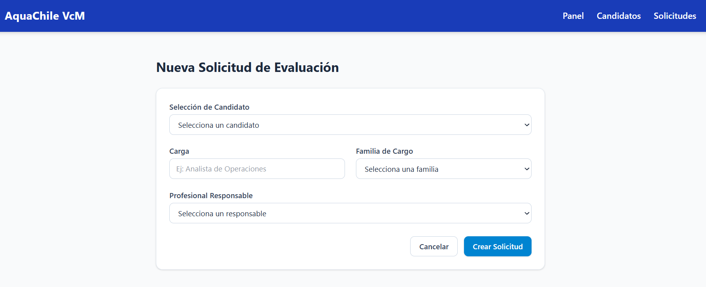

# Sistema Web para la Gestión de Evaluaciones Psicolaborales - AquaChile

## Descripción del proyecto
Producto minimo viable para la asignatura Desarrollo Fullstack II (Proyecto AquaChile). El sistema digitaliza y centraliza la información básica del proceso de evaluación psicolaboral del área de Reclutamiento y Selección de AquaChile.

## Contexto del problema
Actualmente, el proceso se administra mediante múltiples herramientas fragmentadas (Forms, Excel, Planner, correos), lo que genera trabajo manual repetitivo y falta de centralización de la información.

## Estructura del Proyecto
```text
AquaChile/
├── frontend/               # Aplicación React con Vite y Tailwind CSS
│   ├── src/
│   │   ├── components/     # Componentes reutilizables (Layout, etc.)
│   │   ├── pages/          # Vistas (Dashboard, Candidatos, Solicitudes, etc.)
│   │   ├── context/        # Manejo de estados globales
│   │   ├── services/       # Conexión futura a la API backend
│   │   └── utils/          # Funciones genéricas de apoyo
│   └── ...
├── backend/                # (Pendiente de inicializar) Lógica de negocio y API REST
└── docs/                   # Documentación adicional del proyecto
    ├── informe/            # Informes académicos de la asignatura
    ├── documentacion/      # Anexos, requerimientos y manuales
    ├── imagenes/           # Capturas de pantalla y diagramas
    └── otros/              # Material complementario entregado por AquaChile
```

## 🛠️ Justificación del Stack Tecnológico (Frontend)

La elección de **React**, **Vite** y **Tailwind CSS v4** responde a la necesidad de construir una interfaz moderna, altamente reactiva, mantenible y optimizada para la gestión de evaluaciones psicolaborales:

* **React (UI basada en Componentes):** Permite modularizar la interfaz en componentes reutilizables (formularios, tablas, tarjetas de candidatos, vistas de evaluador). Esto facilita la escalabilidad, simplifica la integración futura con la API de Spring Boot y garantiza un estado dinámico fluido sin recargar la página.
* **Vite (Entorno de Desarrollo y Bundler):** Ofrece un entorno de desarrollo ultrarrápido con *Hot Module Replacement* (HMR) instantáneo y tiempos de compilación mínimos. En comparación con herramientas tradicionales como Create React App, Vite optimiza drásticamente la productividad del equipo y genera *builds* de producción ligeros y altamente eficientes.
* **Tailwind CSS v4 (Estilizado de Alta Velocidad):** Proporciona un marco de trabajo *utility-first* que permite diseñar interfaces corporativas limpias, consistentes y 100% adaptables (*responsive*) sin salir del código React. La versión 4 simplifica la configuración del motor CSS y optimiza el rendimiento final, permitiendo aplicar la identidad visual de AquaChile de forma ágil y profesional.


## Estado actual del desarrollo (MVP Frontend)
- [x] Inicialización del repositorio y configuración de React + Tailwind v4.
- [x] Creación de sistema de rutas con React Router.
- [x] Vistas del Analista: Dashboard, Listado de Candidatos, Listado de Solicitudes y Formularios.
- [x] Vistas del Evaluador: Detalle de solicitud y registro de resultados (`DetalleEvaluacion.jsx`).
- [x] Rediseño del Layout con integración del logo corporativo de AquaChile.



## Ejecutar el proyecto
```bash
npm run dev
```
